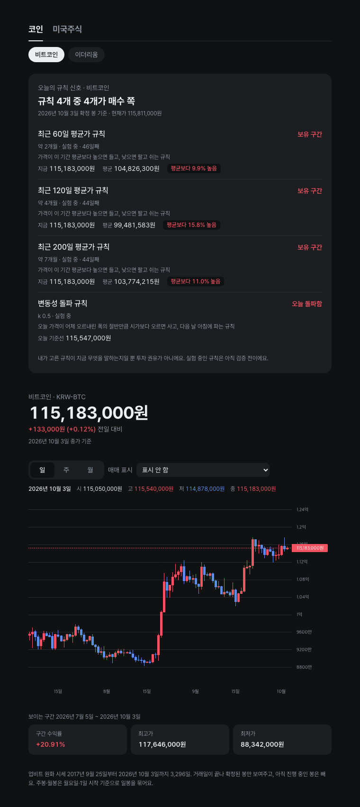
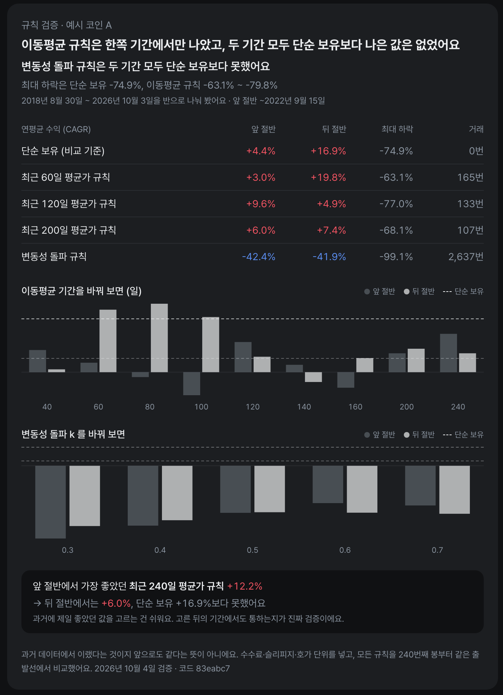

<h1> orbit</h1>

규칙으로 "살지 말지"의 근거를 보여주는 개인 투자 대시보드이자, 퀀트 트레이딩을 만들면서 배우는 연습장.

비트코인·이더리움과 미국 주식·국내 상장 미국 ETF 를 같은 화면에서 보고, 각 규칙이 지금 무엇을 말하는지·과거에 어땠는지를 숫자로 확인한다.



<sub>화면은 가상 데이터로 찍었다 — 실제 시세가 아니다</sub>

> **투자 권유가 아니다.** 화면의 신호는 사용자가 고른 규칙이 말하는 상태일 뿐이고, 백테스트는 과거 데이터로 돌린 결과다. 코드는 있는 그대로 제공되며 사용에 따른 손실 책임은 사용자에게 있다.

## 주요 기능

- **종목 타일** — 맨 위에 전 종목의 가격·전일 대비·최근 3개월 흐름과 한 줄 신호. 누르면 그 종목으로
- **오늘의 규칙 신호** — 규칙마다 보유·현금·돌파 여부, 며칠째인지, 지금 가격이 평균보다 얼마나 높은지·낮은지. 맨 위에 "규칙 N개 중 M개가 매수 쪽"
- **다음 개장 예상** — 국내 상장 미국 ETF 는 국내 장이 닫힌 뒤 미국장·환율 변동을 반영해 다음 날 시가를 추정
- **적립식 분석** — 매달 정해진 날 적립하는 ETF 용. 다음 적립일, 지금 가격이 평균보다 싼지, 그렇게 사 왔다면 어땠는지
- **일봉 차트** — 일·주·월 단위, 확대·스크롤, 백테스트 매수·매도 B·S 표시와 그날의 판단 근거. 보이는 구간의 수익률·최대 하락·연환산 변동성
- **백테스트** — 단순 보유·적립식 기준선과 이동평균·변동성 돌파 규칙을 같은 조건으로 비교·기록. 미국주식은 토스증권 수수료로
- **규칙 검증** — 기간을 반으로 나눠도, 숫자를 바꿔도(40~240일선) 결과가 유지되는지. 앞 절반에서 고른 값이 뒤 절반에서도 통했는지
- **가상 지갑 (dry-run)** — 규칙대로 실제처럼 사고팔되 주문은 내지 않고 장부에만. 예산 격리·리스크 가드·킬 스위치까지 실거래와 같은 경로

좋은 백테스트 결과가 특정 기간·특정 숫자 덕분인지 확인한다. 기간을 반으로 나누고, 이동평균 기간과 변동성 돌파 k 를 바꿔 가며 같은 조건으로 비교한다:



> 업비트·토스증권 모두 API 로 받은 데이터의 배포를 금지한다 (업비트 Open API 이용약관 제5조, 토스증권 데이터 이용 정책). 그래서 README 화면은 가상 데이터로 찍고, 문서에도 실제 시세로 계산한 결과 숫자를 싣지 않는다. 실제 값은 로컬 대시보드에서만 본다.

| 자산 | 종목 | 시세 |
|---|---|---|
| 코인 | 비트코인, 이더리움 | 업비트 공개 API (원화) |
| 미국주식 | QQQ, SPY, ACE 미국나스닥100, TIGER 미국S&P500, TIGER 미국우주테크 | 토스증권 Open API (조회만) |

## 원칙

- **백테스트와 실제 판단이 같은 규칙 코드** — 전략은 확정된 일봉만 보는 순수 함수, 미래 데이터 참조는 테스트로 막음
- **거래소 규칙은 추측하지 않음** — 수수료·최소 주문·호가 단위는 공식 자료로 확인한 값과 출처·확인일을 문서에 남김
- **금액은 소수 오차 없이** — Decimal, DB 에는 최소 단위 정수
- **키는 레포 밖** — `.env` 에만. 토스 키는 주문까지 가능해 엔진은 조회 경로 화이트리스트만 호출
- **자동매매는 사람이 켠다** — 지금은 dry-run(가상 장부)만 있고 실주문 경로는 없음. 실거래 전환·한도 상향은 사람만

## 구조

```
engine/   Python 3.13 · uv — 시세 수집, 전략, 백테스트, 신호, 적립식 분석, FastAPI
web/      Next.js 16 · Tailwind · lightweight-charts — 대시보드
docs/knowledge/   규칙·용어·백테스트 함정·거래소 규칙 문서
```

## 실행

필요: Python 3.13 + [uv](https://docs.astral.sh/uv/), Node 20+ + pnpm

```bash
cp .env.example .env   # 토스증권 Open API 키 (미국주식·국내 ETF 시세용, 허용 IP 등록 필요)
```

```bash
cp config/orbit.example.yaml config/orbit.local.yaml   # 가상 지갑을 쓰려면 — 예산·규칙을 내 것으로 (커밋 안 됨)
```

```bash
./scripts/dashboard.sh            # 시세 갱신 → 오늘 판단 기록(dry-run) → 엔진 API + 웹 → 브라우저. Ctrl+C 로 둘 다 종료
./scripts/dashboard.sh --no-sync  # 시세 갱신 없이 바로
```

서버를 늘 켜 두지 않고 볼 때만 띄운다. 토스 시세는 허용 IP 에서만 받아지고, 다른 곳에서는 코인만 새로 받고 나머지는 마지막 데이터로 보인다.

`http://localhost:3000` 에서 확인. 엔진 API(8000)는 이 기기에서만 열린다.

| 명령 (`engine/` 에서 `uv run orbit …`) | 하는 일 |
|---|---|
| `sync-candles --market KRW-BTC` | 업비트 일봉 수집 (확정 봉만, 이어 받기) |
| `sync-stocks` | 토스증권에서 주식·ETF 일봉 수집 |
| `signal --market KRW-BTC` | 오늘의 규칙 신호를 터미널로 |
| `compare-strategies --strategies hold,ma-120,vb-0.5` | 같은 조건으로 전략 비교, 결과 기록 |
| `backtest --monthly 1000000` | 단순 보유 vs 적립식 |
| `validate` | 규칙 검증 — 기간 분리·파라미터 민감도를 기록 (코인·미국주식) |
| `dry-run` | 오늘 규칙대로 가상 장부에 사고팔기 — 실제 주문 없음, 하루 한 번 (`config/orbit.local.yaml` 필요) |
| `wallet` | 가상 장부 — 규칙 칸마다 예산·현금·보유·손익 |
| `serve` · `openapi` | 대시보드용 API · 웹 타입 생성용 명세 |

## 문서

- [orbit 이 쓰는 규칙](docs/knowledge/orbit-rules.md) — 한 줄 요약, 공통 가정, 전략별 규칙·결과, 신호·적립식 계산
- [투자 규칙 카탈로그](docs/knowledge/strategies.md) · [리스크 관리](docs/knowledge/risk-management.md) · [백테스트 함정](docs/knowledge/backtest-pitfalls.md) · [용어집](docs/knowledge/glossary.md)
- [업비트 KRW 마켓 규칙](docs/knowledge/upbit-krw-market.md) · [토스증권 Open API](docs/knowledge/toss-open-api.md) · [토스증권 수수료](docs/knowledge/toss-fees.md)

## 라이선스

[MIT](LICENSE)
